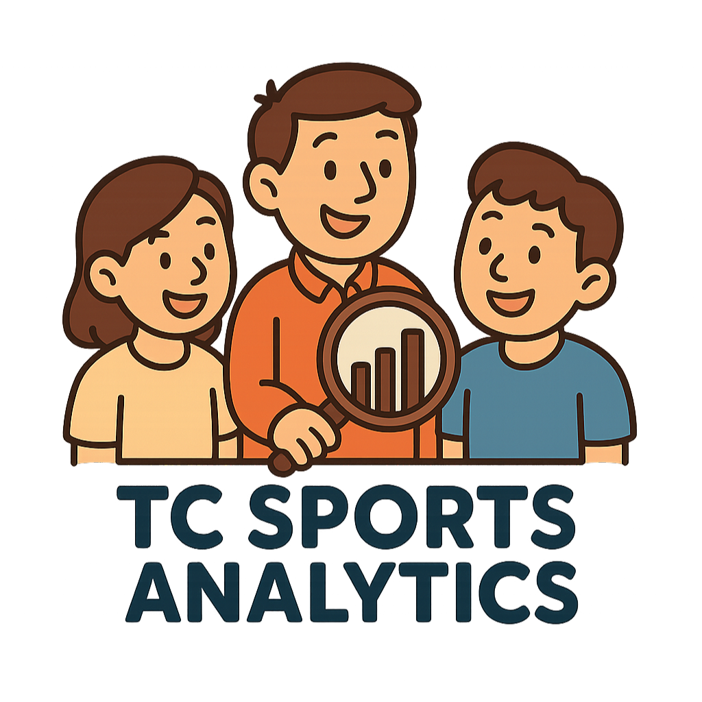

# tcsa – tc sports analytics ⚽🏀

  

Welcome to the playground of our data-driven sports insights! 🏟️📊  
This repository hosts a collection of projects and explorations on **tcsa**—a growing research group from the *Informatics Department, Institut Teknologi Sepuluh Nopember (ITS), Surabaya, Indonesia*.  
Contact me for more information: [Ilham G. Adillion](https://scholar.google.co.id/citations?user=KJHvkTUAAAAJ&hl=en)

Our focus areas include:

- TBA

Whether you're a researcher, a student, or just curious about how analytics transforms the sports world, we hope that you'll find something valuable
